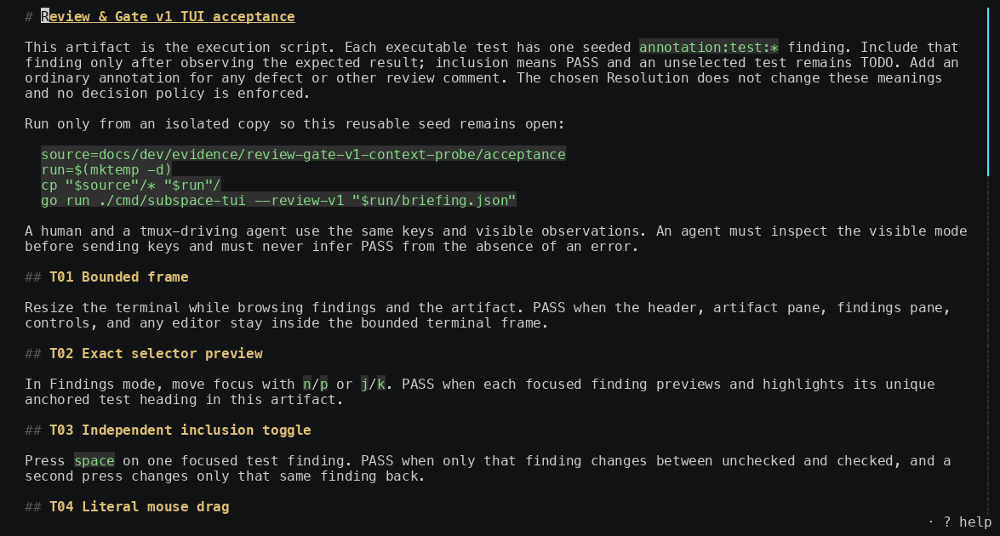
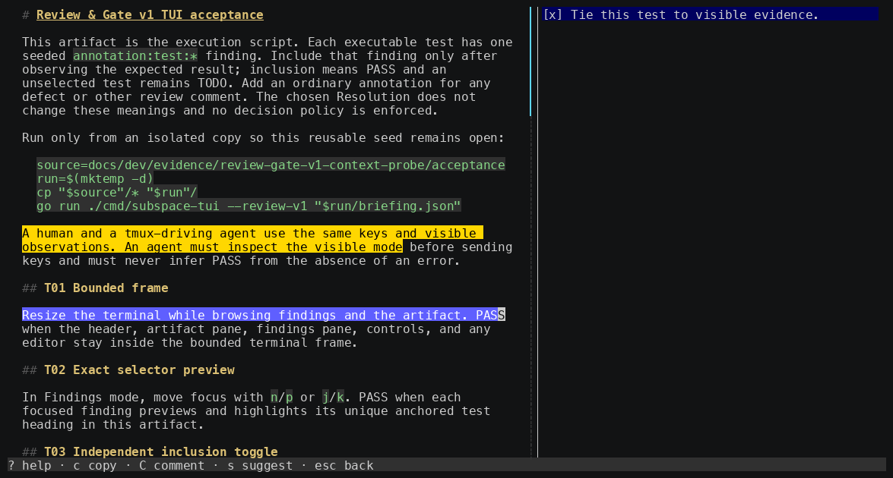

# Subspace

Review one Markdown file in your terminal.

Subspace includes a companion agent skill that launches its focused reader in
Zellij, tmux, CMUX, Herdr, Ghostty, or Apple Terminal. It sends comments and
suggested edits directly back to the invoking agent, attached to exact text.



## Install and try it

```sh
brew install spacedock-dev/tap/subspace-beta
```

```sh
sr path/to/file.md
```

From an agent session with the companion skill installed, invoke:

```text
/r path/to/file.md
```

In Codex, invoke:

```text
$r path/to/file.md
```

Press <kbd>?</kbd> from any non-editor review surface to see its current
keyboard shortcuts.



## License

The Subspace skills are released under Apache 2.0. The `subspace-tui` tool
itself is not currently open source. The permissions and attributions for
external code linked into the tool are published in
[`THIRD_PARTY_NOTICES.txt`](THIRD_PARTY_NOTICES.txt).
